

  

 

  <i>"Code, purple aesthetics, playlists on repeat, and the excitement of watching an idea slowly come to life."</i>

 

| 🚀 Open Source | 💻 Building | 🌱 Currently | 📍 Based In |
| :---: | :---: | :---: | :---: |
| Active Contributor | AI • Backend • Full Stack | Learning System Design | Delhi, India 🇮🇳 |

 

  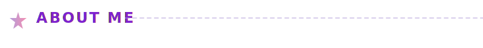

<table align="center" width="100%">
<tr>
<td valign="top" width="50%">

### 👩‍💻 About Me

I'm a Computer Science (AI) undergraduate who loves turning ideas into products that people actually enjoy using.

Most of my time goes into building AI-powered applications, backend systems, and developer tools, while contributing to open source and learning from real-world codebases.

I'm especially interested in the intersection of AI, scalable engineering, and thoughtful design—building software that's both useful and enjoyable to use.

 

 
 

  

### 🎓 Education

**Computer Science (AI)**  
IGDTUW '29  
Delhi, India 🇮🇳

</td>
<td valign="top" width="50%">

### 🚀 Current Focus

⚡ **Building** AI applications that solve real-world problems  
 
🛠 **Contributing** to production open-source projects  
 
📦 **Learning** scalable backend architecture & system design  
 
🤖 **Exploring** LLMs, AI agents, and automation workflows  
 
🌐 **Experimenting** with Web3 and developer tooling  

  

### 🤝 Community

**Core Member** • VoidSwift  
 
**Open Source Contributor**  
 
**Hackathon Builder**

</td>
</tr>
</table>

 

  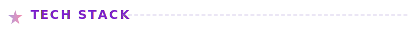

 

<table align="center" width="100%">
<tr>
<td align="center" width="33%">
  <h3>Languages</h3>
  
</td>
<td align="center" width="33%">
  <h3>Frontend</h3>
  
</td>
<td align="center" width="33%">
  <h3>Backend</h3>
  
</td>
</tr>
<tr>
<td align="center" width="33%">
  <h3>AI & Data</h3>
  
</td>
<td align="center" width="33%">
  <h3>Tools & DevOps</h3>
  
</td>
<td align="center" width="33%">
  <!-- Empty -->
</td>
</tr>
</table>

 

  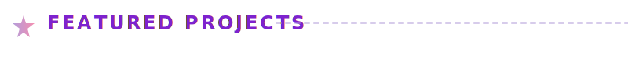

  
  

  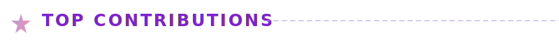

  
  

 

  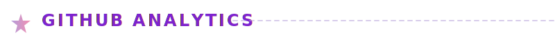

  
  

 

  

 

  <picture>
    <source media="(prefers-color-scheme: dark)" srcset="https://raw.githubusercontent.com/pavsoss/pavsoss/output/github-contribution-grid-snake-purple.svg">
    <source media="(prefers-color-scheme: light)" srcset="https://raw.githubusercontent.com/pavsoss/pavsoss/output/github-contribution-grid-snake.svg">
    
  </picture>

 

 

  <!-- 3D Graph -->
  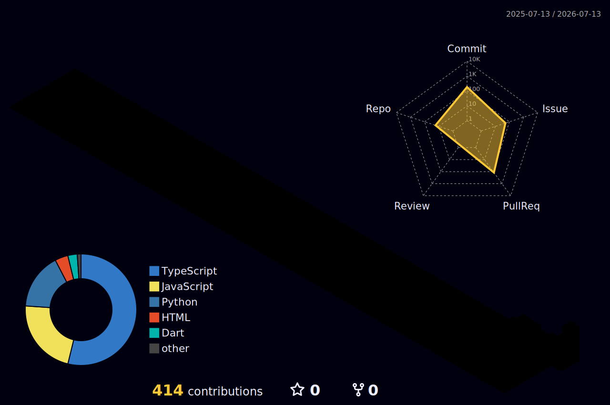

 

  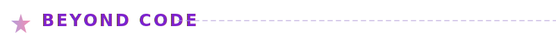

  "When I'm not coding..."

 

  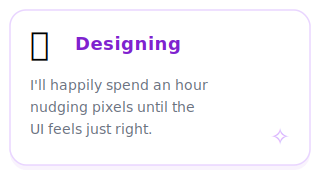
  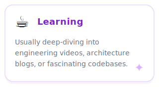
  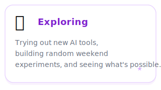
   
  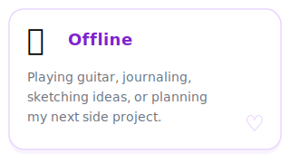
  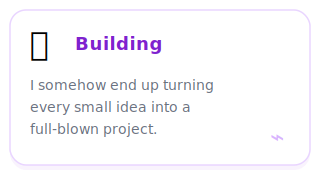
  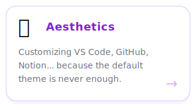

 

  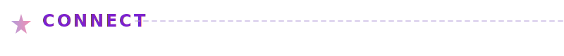

 

  
  
  

  

  

