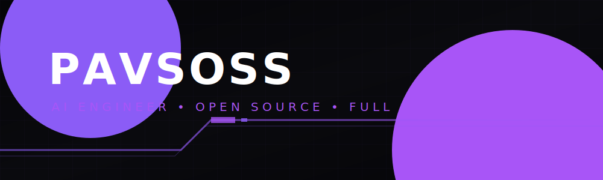

<div align="center">
  

  <br />

  <a href="https://github.com/pavsoss">
    
  </a>
  <a href="mailto:pavsafterdark@gmail.com">
    
  </a>
</div>

<br />


## ⚡ System Prompt: Whoami

```json
{
  "status": "online",
  "role": "Computer Science (AI) Student",
  "focus": ["Artificial Intelligence", "Backend Systems", "Developer Tools", "Web3", "Full Stack"],
  "mission": "Building impactful products and solving real engineering problems.",
  "learning": "Always learning."
}
```


## 🛠️ Tech Stack Architecture

<div align="center">
  
  <br/>
  
  <!-- Languages -->
  
  
  
  

  <br/>

  <!-- Frontend & Backend -->
  
  
  
  

  <br/>

  <!-- AI & Data -->
  
  
  

  <br/>
  
  <!-- Tools & DevOps -->
  
  
  
</div>

<br />


## 🚀 Core Modules (Projects)

| Project | Description | Stack |
|---------|-------------|-------|
| 🔗 **[MergeShip](https://github.com/pavsoss/MergeShip)** | A gamified open-source bridge for contributors to find issues and earn XP. | TypeScript |
| 🛡️ **[TENET-AI](https://github.com/pavsoss/TENET-AI)** | AI-driven cybersecurity system detecting and defending against modern threats. | TypeScript |
| 👁️ **[AgentWatch](https://github.com/pavsoss/AgentWatch)** | Real-time reasoning auditor and observability platform for AI agents. | Python |
| 🔐 **[auth-server](https://github.com/pavsoss/auth-server)** | Production-ready OAuth 2.0 Provider microservice with MFA and RBAC. | Go |
| 🏥 **[MediFlow](https://github.com/pavsoss/MediFlow)** | AI-powered medical logistics platform for smart resource allocation. | Dart |

<br />


## 📊 Telemetry & Analytics

<div align="center">
  
  
</div>

<br />

<div align="center">
  
</div>

<br />


## ⚡ Activity Stream

<a href="https://github.com/pavsoss">
  
</a>

<br />


<div align="center">
  <i>"Code is poetry written for machines to execute and humans to understand."</i>
</div>

<br />

<div align="center">
  
</div>
